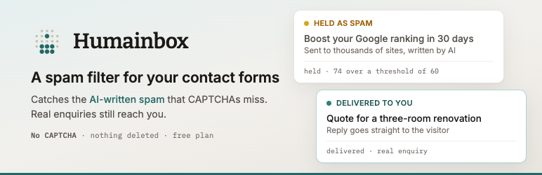

# Humainbox for WordPress

Shows you where every contact form on your site sends its notifications, and lets you
point them all at one address.

A site picks up forms over the years. One in the theme, one a plugin added, one the last
agency built — each with its own notification settings on its own screen. This plugin puts
them in a single table so you can see, in one go, who actually gets the enquiries.

## What it does

- **Lists every form and the address it notifies.** No account, nothing leaves your site.
- **Repoints the ones you pick.** Tick them, paste an address, apply.
- **Puts them back.** Every original address is saved before anything changes.

It also flags forms that notify **nobody**, which is commoner than it sounds and a lot
more expensive.

## Works with

Contact Form 7, WPForms, Gravity Forms, Elementor Forms (Elementor Pro), Ninja Forms,
Fluent Forms, Forminator and Formidable Forms. Each has its own adapter in
`includes/adapters/`, and each writes through that plugin's own models or storage API
rather than with SQL of its own — and, where a plugin's own save would lose something
(backslashes, other notifications, unloaded settings), around that loss. The comment at
the top of each adapter says what it was and how it is avoided.

Some recipients can't be changed safely, and those are refused instead of overwritten.
Contact Form 7 is the one to watch: its recipient is often a mail tag — `[your-email]`,
or a shortcode that resolves to the author of whatever listing is on screen. (The site's
own admin tags, such as `[_site_admin_email]` or `{wp:admin_email}`, resolve to one fixed
address, and those are changed.) Overwrite one of those and every enquiry goes to the wrong person, on every
form, with nothing to tell you it happened.

## Requirements

WordPress 6.2 or newer, PHP 7.4 or newer, and one of the form plugins above.

## Installing

From wordpress.org, install it like any other plugin. From here, run `bin/build.sh` and
upload the zip it writes, or clone straight into `wp-content/plugins/`.

Settings live under **Settings → Humainbox**.

## What it doesn't do, and how to check

Three things, and you can confirm each one in about ten seconds.

### It never makes a network request

```sh
grep -rnE "wp_remote_|curl_init|curl_exec|fsockopen|file_get_contents|fopen" \
  --include="*.php" humainbox.php includes/ admin/
```

You'll get one hit, and it's a comment. That's the lot — no licence check, no usage ping,
no telemetry. Your form addresses never go anywhere, including to us.

### It never touches the front end

```sh
grep -rnoE "add_(action|filter)\( *'[a-z_]+'" --include="*.php" humainbox.php includes/ admin/
```

Every hook that comes back is an admin one. There's no `the_content` filter, no shortcode,
and nothing enqueued on public pages. A visitor can't tell it's installed.

### It stores two options, and that's all

```sh
grep -rnoE "(update|add|delete)_option\( *[A-Z_]+" --include="*.php" humainbox.php includes/ admin/
```

| Option | What's in it |
| --- | --- |
| `humainbox_settings` | the address you saved |
| `humainbox_original_recipients` | what each form sent to before you changed it |

The second one is what makes Restore work, so nothing is written to a form without being
written there first. If that snapshot is missing, Restore refuses rather than guessing —
an early version rebuilt the address from a display string and mangled forms that had more
than one notification.

`bin/review-check.php` blocks `curl_init`, `curl_exec`, `fsockopen`, `add_shortcode` and
`add_filter( 'the_content' )` outright, so a release carrying any of them won't build.

## Building a release

```sh
bin/build.sh
```

Writes `humainbox.zip`: the plugin files, `readme.txt` and `LICENSE`. Anything listed in
`.distignore` stays out — this README, the dev script, the banner and icon. Those files
between them accounted for 41 of the 44 findings the first Plugin Check run turned up,
which is why the list is worth keeping accurate.

## About Humainbox

**This plugin doesn't filter anything.** All it does is change where your forms send.
The filtering happens at the address you point them at.

Contact form spam used to be easy to spot: bad grammar, a wall of links, an offer of SEO
work. Honeypots and keyword blocklists worked because the spam looked like spam. A
growing share of it is written by a model now, and that share doesn't look like spam at
all — it mentions your last project, names your town, and asks for fifteen minutes on
Thursday. It gets past a blocklist because it uses no blocked words, and past a CAPTCHA
because solving those is something you can pay for.

Tightening the old defences doesn't help, either. It just starts catching real enquiries,
and a held enquiry is silent: you find out when somebody asks why you never replied.

So Humainbox checks what a message says rather than how it was submitted. Junk is held
back, real enquiries go to whoever should answer them, and nothing is ever deleted —
anything held stays in your account. An account is free to open and free while you
evaluate, with no card. You can also start in dry run, where everything is delivered
exactly as it is today and you get a list at the end of the week of what *would* have
been held, before you let it hold anything.

None of that is needed for the first half of this plugin, which works on its own: knowing
where your forms deliver is worth knowing whether or not you change anything afterwards.

[humainbox.com](https://humainbox.com) · [how we measured 598 contact pages](https://humainbox.com/research/contact-pages-2026)

## Licence

GPL-2.0-or-later. See [LICENSE](LICENSE).
